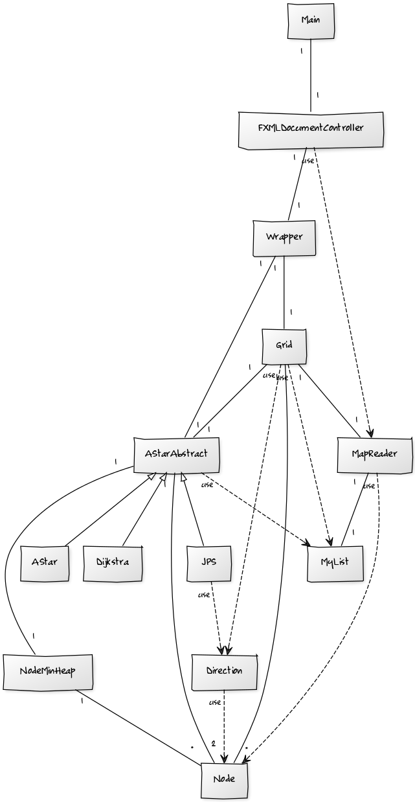
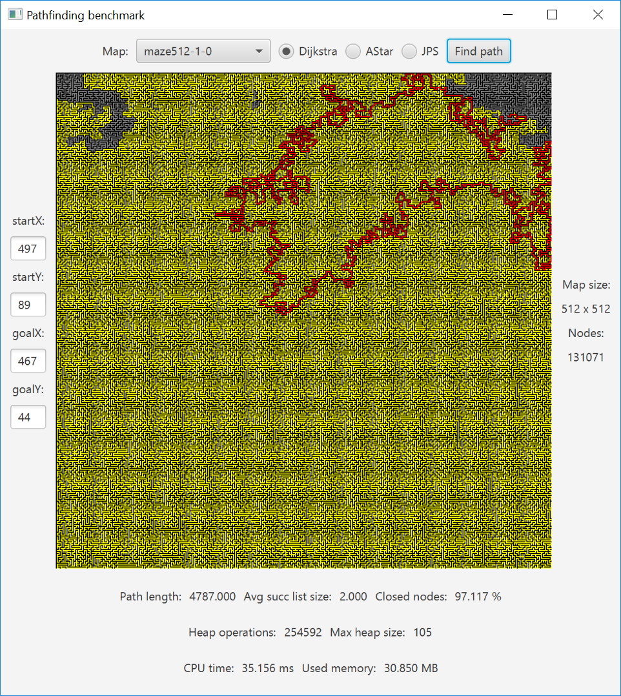
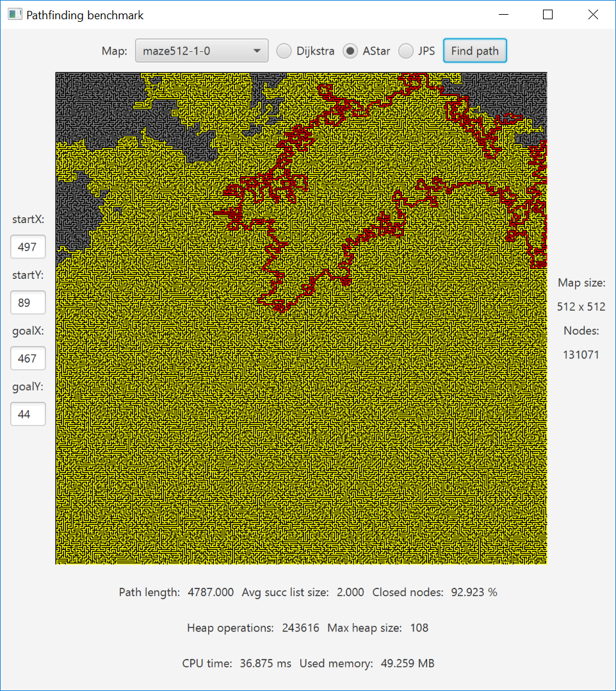
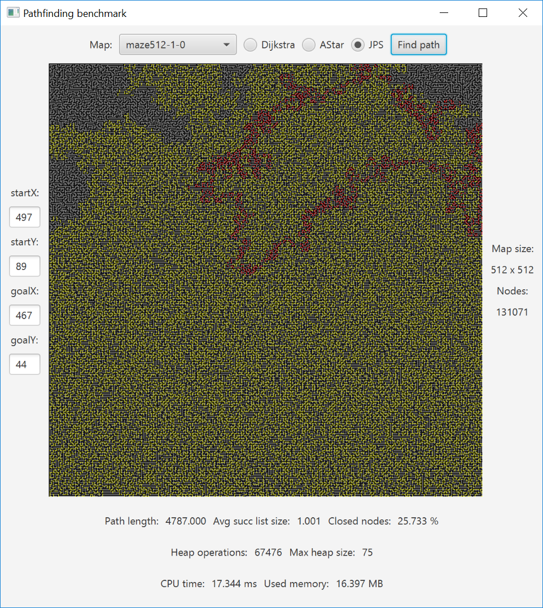
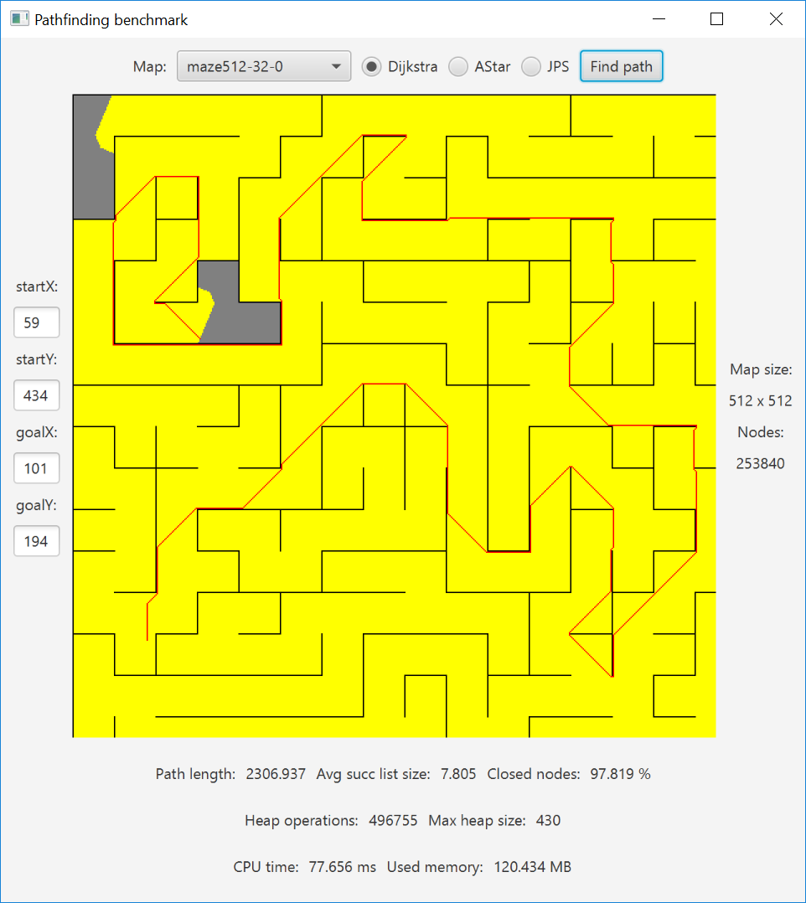
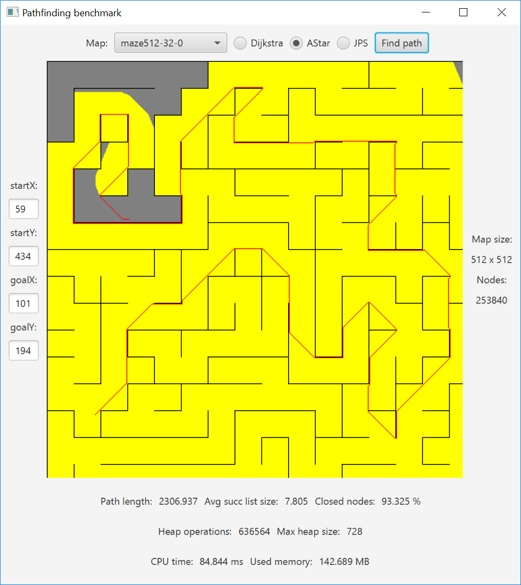
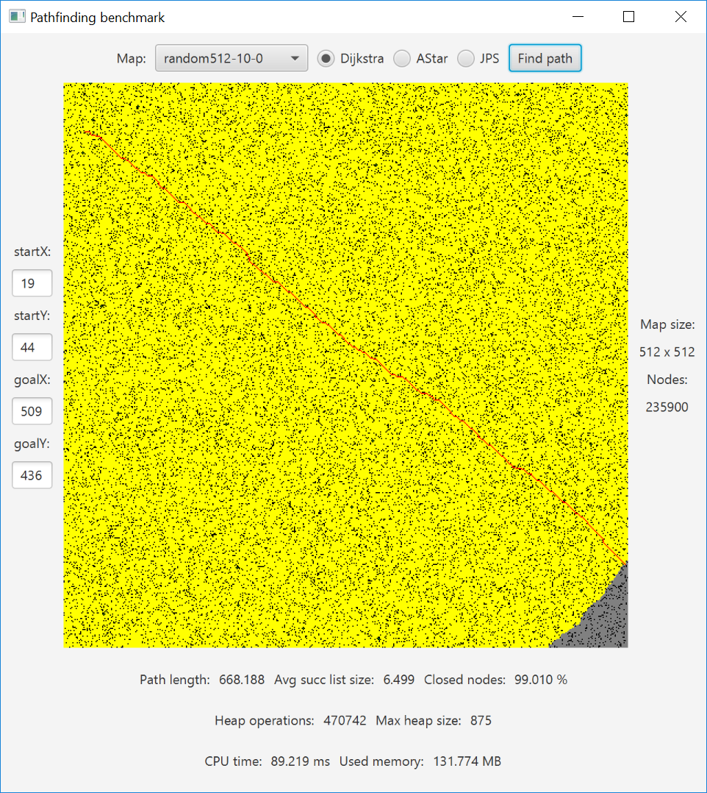
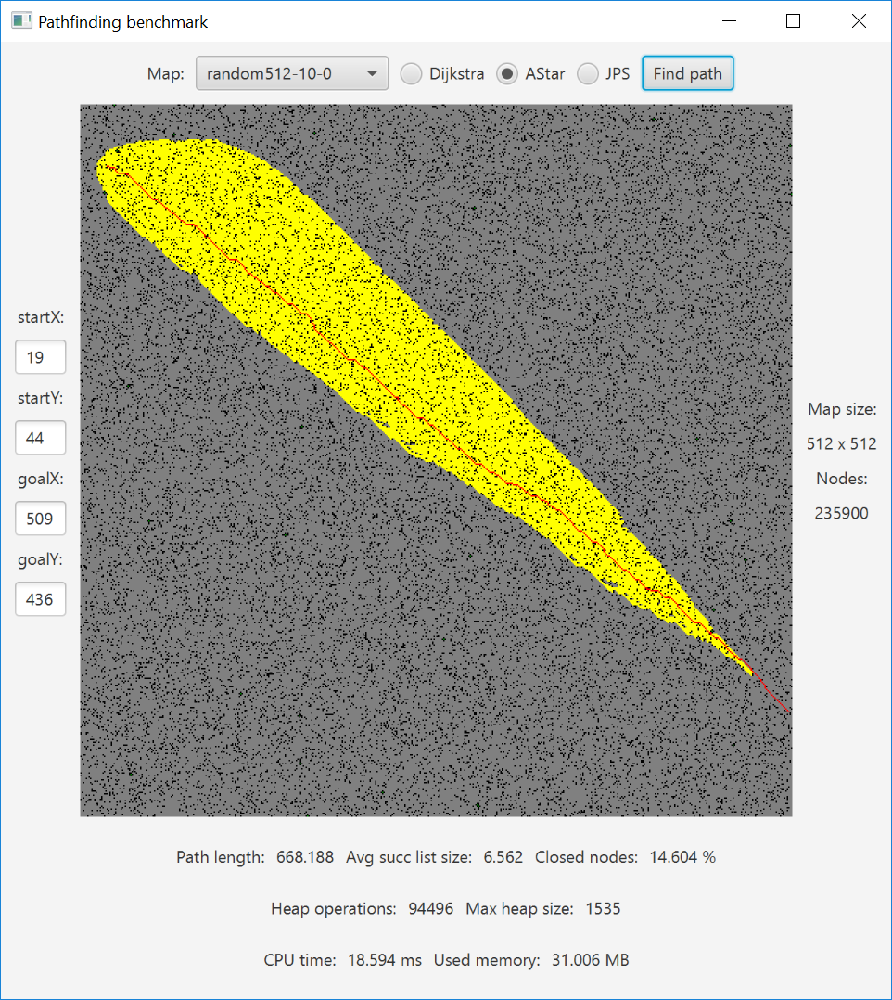
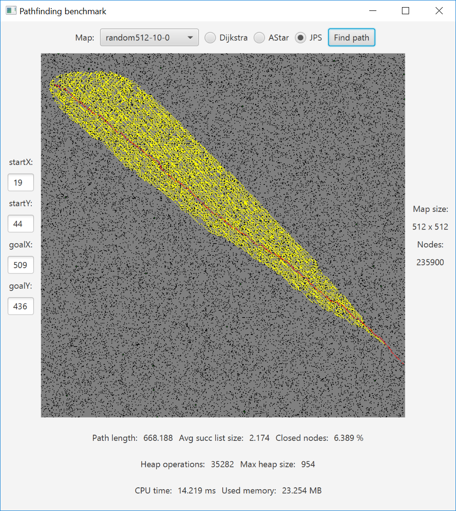

# Toteutusdokumentti

## Luokkakaavio

## Ohjelman rakenne
Ohjelma on jaettu viiteen pakkaukseen, jotka ovat algoritmit, tietorakenteet, verkko, käyttöliittymä ja muut apuluokat. Toteutuksessa on pyritty siihen, että kullakin algoritmilla olisi suorituksensa alussa mahdollisimman tasapuoliset lähtökohdat, joten niillä on käytettävissä vain verkkoa esittävä taulukko solmu-olioita. Käytössä ei ole esim. valmiiksi tehtyjä vieruslistoja, koska tällöin ei juurikaan vieruslistoja hyödyntävä JPS olisi alakynnessä.

Algorithms-pakkauksessa sijaitsevat abstrakti AStarAbstract, joka toimii pohjana kaikille kolmelle algoritmille, sekä kolmea toteutettua algoritmia kuvaavat luokat AStar, Dijkstra ja JPS. Algoritmiuokat on kirjoitettu siten, että mahdollisimman suuri osa algoista on yhteistä ja sijaitsee AStarAbstract-luokassa. Dijksta-luokassa on täten vain luvun 0 palauttava heuristinen funktio. JPS-luokka sisältää metodin, joka etsii keosta poistetun solmun seuraajat, sekä tämän lukuisat apumetodit. Muuten sekään ei eroa AStarAbstract-luokasta.

Datastructures-pakkauksesta löytyy minimikeko NodeMinHeap ja geneerisen listan toteutus MyList. NodeMinHeap on toteutettu binäärikekona. Keon alkioina ovat Node-oliot ja avaimena toimii solmujen etäisyyden ja heuristisen arvon summana saatu prioriteetti. Keon toteutus tukee myös heap-dec-key-operaatiota. MyList tukee vain tarvittavia operaatioita add, get, size ja contains.

Grid-pakkaus sisältää samannimisen luokan Grid, joka puolestaan sisältää tiedostosta luetun kartan esityksen kaksiulotteisena, solmu-olioita sisältävänä taulukkona ja tukee esim. kartan tiettyissä koordinaateissa sijaitsevan solmun läpikuljettavuuden selvittämistä, solmun vieruslistan etsimistä sekä tietyssä suunnassa sijaitsevan solmun läpikuljettavuuden selvittämistä. Grid-olio osaa myös kertoa voidaanko solmusta edetä tiettyyn suuntaan, ottaen huomioon että kulmien läpi ei saa oikaista. Pakkauksessa on myös verkon solmua kuvaava Node-olio, jonka luokkamuuttujia ovat mm. solmun etäisyys lähtösolmusta, solmun heuristinen arvo, solmun koordinaatit, sen tyyppi sekä tieto siitä kuuluuko solmu suljettuun joukkoon.

GUI-pakkaus sisältää graafisen käyttöliittymän. Itse graafisten komponenttien määrittely löytyy resurssitiedostosta FXMLDocument, mutta mm. tapahtumankäsittelijät sijaitsevat FXMLDocumentController-luokassa. Algoritmiluokkien tarjoamat tulokset käyttäjälle esitettävään muotoon puolestaan muokkaa Wrapper-luokka, jota käyttöliittymä aktiivisesti hyödyntää.

Util-pakkauksen sisältöön kuuluu JPS:n käyttämä Direction, joka on käytännössä suuntavektori, sekä kartanlukijaa kuvaava luokka MapReader. MapReader osaa mm. kertoa mitä karttoja on tarjolla maps/ -kansiossa Se osaa myös luoda yksittäisestä map-tiedostosta solmuolioita sisältävän taulukon.

## Vaativuusanalyysi ja vaativuuksien vertailu
Listan osalta get ja size operaatiot ovat vakioaikaisia ja add-operaatio tasoitetusti vakioaikainen, koska raskas yksiulotteisen taulukon koon kasvatusoperaatio suoritetaan harvoin. Contains-operaation aikavaativuus on lineaarinen, koska se käy tarvittaessa koko taulukon läpi. Listan tilavaativuus on lineaarinen lukujen määrän suhteen.

Koska minimikeko on toteutettu binäärikekona, on sen kaikkien toteutettujen operaatioiden aikavaativuus O(log |V|). Koska keon koko riippuu sen sisältämien solmujen määrästä on sen tilavaativuus O(|V|).

Koska Dijkstran algoritmi lisää ja poistaa jokaisen solmun keosta korkeintaan kerran, suorittaa heap-dec-key-operaation korkeintaan kaarien määrän verran ja keko-operaatioilla on edellä mainittu logaritminen aikavaativuus, niin Dijkstran toteutuksen aikavaativuus on O((|E| + |V|) log |V|).

Koska A*:n toteutus eroaa Dijkstrasta vain valkioaikaisen heuristisen funktion osalta, on sen toteutuksen aikavaativuus myös O((|E| + |V|) log |V|).

JPS:n toteutus eroaa A*:n toteutuksesta vain funktion, joka etsii keosta poistetulle solmulle sen seuraajat, osalta. JPS:n toteutuksessa tämän funktion ensimmäinen osa käy läpi kerran kaikki maksimissaan kahdeksan vierussolmua karsien, joten tämä vaihe on vakioaikainen. Toinen vaihe on rekursiivinen, alkaen jokaisesta jäljelle jääneestä naapurista, edetään suoraa pitkin kunnes vastaan tulee sääntöjen mukainen hyppysolmu, maalisolmu tai seinä. Hyppysolmun löytäminen merkitsee sitä, ettei ylihypättyjä solmuja koskaan edes laiteta kekoon. Jos taas törmätään seinään, naapurille ei löydy seuraajaa, joten se hylätään.

Koska pahimmillaan kaikki solmut voivat olla keossa samanaikaisesti ja koska aputietorakenteiden koko on myös lineaarinen solmujen määrän suhteen, on kaikkien kolmen algoritmin tilavaativuus O(|V|).

## Suorituskykyvertailu
### Yleistä
Algoritmeja vertaillaan graafisen käyttöliittymän avulla, joka näyttää käyttäjälle mm. kuvan kartasta, johon on merkitty laajennettavat, eli keosta poistetut, solmut keltaisella sekä lyhimmällä polulla olevat solmut punaisella. Muut tavat vertailla algoritmien suorituskykyä on toteutettu erilaisten laskureiden ja järjestelmäkutsujen avulla. Nämä ovat lyhimmän polun pituus, keosta poistettuja solmuja laajennettaessa luodun vieras- tai seuraajalistan keskimääräinen koko, keon insert, del-min ja dec-key operaatioiden määrät, suoritusaika sekä käytetyn muistin määrä. Kaikki edellä mainitut näkyvät käyttäjälle GUI:ssa.

### Havainnot
Todella tiheissä labyrinteissä A*:n heuristiikasta ei ole mitään hyötyä, joten sen suoritusaika on Dijkstran tasoa, mutta JPS osaa hyppiä suorien osuuksien yli.

Ei niin tiheissä labyrinteissä sama juttu Dijkstran ja A*:n osalta. Nyt heuristiikan hyödyttömyys näkyy erityisesti dec-key-operaatioiden määrässä, koska A* joutuu etsimään vaihtoehtoisia reittejä. JPS taas pystyy hyppimään paljon pidempiä matkoja ja on todella nopea.

Kartoissa, jotka ovat tyypiltään tiheitä metsiä, heuristiikka nousee arvoonsa ja A* on todella hyvä. Toisaalta nyt JPS ei pysty karsimaan niin monia naapureita koska sen sääntöihin sopivia hyppysolmuja löytyy joka puolelta. Tämä näkyy JPS:n seuraajalistan koon korkeassa keskiarvossa sekä korkeassa määrässä kekoon lisättäviä solmuja suhteessa A*:een. Tämä taitaa olla yksi JPS:n pahimpia tapauksia.

## Lähteet
- TiRa-kurssin materiaali.
- [Implementation of A*](http://www.redblobgames.com/pathfinding/a-star/implementation.html)
- [Heuristics](http://theory.stanford.edu/~amitp/GameProgramming/Heuristics.html)
- [Jump Point Search](https://harablog.wordpress.com/2011/09/07/jump-point-search/)
- [Online Graph Pruning for Pathfinding on Grid Maps](http://users.cecs.anu.edu.au/~dharabor/data/papers/harabor-grastien-aaai11.pdf)
- [The JPS Pathfinding System](http://users.cecs.anu.edu.au/~dharabor/data/papers/harabor-grastien-socs12.pdf)
